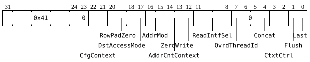

# `PACR` (Move datums from `Dst` to L1)

**Summary:** Issue work to the packer, which will move some number of datums from `Dst` to a contiguous range of L1, possibly performing some minor data transformations in the process. Between one and four `Dst` read interfaces can be enabled, and each enabled read interface contributes one row of `Dst`.

**Backend execution unit:** Packer

> [!TIP]
> Compared to Wormhole, Blackhole has a single packer with four `Dst` read interfaces in place of Wormhole's four packers, and `PACR` selects read interfaces (`ReadIntfSel`) rather than packers (`PackerMask`). The pipeline stages are otherwise similar to Wormhole's, for which see [`Packers/README.md` in the Wormhole tree](../../../WormholeB0/TensixTile/TensixCoprocessor/Packers/README.md); only the `Dst` read interface behavior is documented here.

## Syntax

```c
TT_PACR(/* u2 */ CfgContext, /* u3 */ RowPadZero, /* bool */ DstAccessMode,
        /* u2 */ AddrMod, /* u2 */ AddrCntContext, /* bool */ ZeroWrite,
        /* u4 */ ReadIntfSel, /* bool */ OvrdThreadId, /* bool */ Concat,
        /* u2 */ CtxtCtrl, /* bool */ Flush, /* bool */ Last)
```

## Encoding



## Functional model

### `Dst` read interfaces

The packer has four `Dst` read interfaces. `ReadIntfSel` is a mask of which read interfaces to enable, and each enabled read interface reads one row of 16 datums from `Dst`. Read interface `i` always reads `Dst` row `(StartRow & ~3) | i`, where `StartRow` is the starting `Dst` row determined by the [input address generator](../../../WormholeB0/TensixTile/TensixCoprocessor/Packers/InputAddressGenerator.md), so all four read interfaces address the same aligned group of four `Dst` rows, and the enabled subset of them is selected relative to `StartRow`:

```c
uint4_t ReadIntfMask = CurrentInstruction.ReadIntfSel;
if (ReadIntfMask == 0) ReadIntfMask = 0b1111; // as a special case, 0 enables all four
if ((ReadIntfMask << (StartRow & 3)) > 0b1111) {
  UndefinedBehavior(); // every enabled read interface has to stay within the group of four
}
for (unsigned i = 0; i < 4; ++i) {
  if (ReadIntfMask & (1 << i)) {
    CurrentPacker.ReadDstRow((StartRow & ~3) | i); // appended to the packed output
  }
}
```

The datums from the enabled read interfaces are packed to L1 contiguously, in increasing read interface order, with no gap or padding between rows. Each read interface always reads all 16 datums of its row, but only the datums selected by the ADC X range and by [downsampling](../../../WormholeB0/TensixTile/TensixCoprocessor/Packers/Downsampling.md) are packed, so a `ReadIntfSel` with `N` bits set packs `N * D` datums, where `D` is the number of datums packed per row (`16` when a whole row is packed). The packer's L1 write position advances by exactly that many datums, and for BFP formats its exponent write position advances by `N`.

|`ReadIntfSel`|`Dst` rows read, when `StartRow` is a multiple of four|Datums packed, whole rows|
|---|---|---|
|`0b0000`|`StartRow + 0`, `+1`, `+2`, `+3` (i.e. as `0b1111`)|64|
|`0b0001`|`StartRow + 0`|16|
|`0b0011`|`StartRow + 0`, `+1`|32|
|`0b0111`|`StartRow + 0`, `+1`, `+2`|48|
|`0b1111`|`StartRow + 0`, `+1`, `+2`, `+3`|64|
|`0b0101`|`StartRow + 0`, `+2`|32|
|Any other value|The rows named by its set bits, in increasing order|16 per set bit|

Masks with three bits set are useful for packing a tensor whose final group of rows is not a multiple of four rows long: packing 48 datums leaves the 49th onwards untouched in L1, whereas packing 64 datums and relying on edge masking or `RowPadZero` to zero the tail would write past the end of the data. Software can compute such a mask branch-free as `(1 << RowsRemaining) - 1`, which for four remaining rows gives `0b1111`; that behaves identically to `0`, so the `0` special case does not need to be special-cased by software. Note that the packer writes L1 in units of 16 bytes, so for sub-byte output formats, flushing the output buffers (via `Last` or `Flush`) will zero the remainder of the final 16 byte block: 48 datums of BFP4 occupy 24 bytes, and the eight bytes after them are zeroed.

> [!TIP]
> The `THCON_SEC0_REG1_Auto_set_last_pacr_intf_sel` configuration field causes hardware to compute `ReadIntfSel` for the final `PACR` of an xy plane from the number of rows remaining in the plane, which produces exactly the `0b0001` / `0b0011` / `0b0111` / `0b1111` masks.

The tile position used for [edge masking](../../../WormholeB0/TensixTile/TensixCoprocessor/Packers/EdgeMasking.md) advances by the number of enabled read interfaces per `PACR`, not by the number of datums each of them read, with the `k`'th enabled read interface (counting only enabled interfaces) using tile row position `TilePosition + k`. `TilePosition` is an 8 bit counter whose low four bits give the tile row; it returns to zero, starting the next xy plane, only when advancing it lands exactly on `PACK_COUNTERS_SEC0_pack_reads_per_xy_plane`, so if the number of enabled read interfaces does not divide the configured rows per xy plane, the counter steps over that value and keeps incrementing instead.

### Instruction fields

* `ReadIntfSel`: as above.
* `AddrMod`: used by the input address generator and the output address generator to manipulate ADC Y/Z values in preparation for the _next_ `PACR` instruction.
* `ZeroWrite`: used by the input address generator (to fetch datums from `/dev/null` rather than `Dst`).
* `OvrdThreadId`: used by the input address generator and the output address generator to determine which ADC is in use.
* `Concat`: if [compression](../../../WormholeB0/TensixTile/TensixCoprocessor/Packers/Compression.md) is enabled, setting this to `true` causes the _next_ `PACR` instruction to continue the current compression row rather than starting a new compression row. If compression is disabled, then there is no inherent concept of compression row, and this field only has an effect via `RowPadZero`.
* `Flush`: used by the input address generator (overrides the datum count to zero) and the output address generator (flushes the output buffers sitting before L1 and causes the _next_ `PACR` instruction to start at fresh output addresses).
* `Last`: used by the output address generator (flushes the output buffers sitting before L1 and causes the _next_ `PACR` instruction to start at fresh output addresses).
* `DstAccessMode`: selects the strided `Dst` read mode, in which the enabled read interfaces read rows 16 apart rather than adjacent rows. This mode is intended for use with `DEST_ACCESS_CFG_swizzle_32b` and `DEST_ACCESS_CFG_remap_addrs`; its interaction with `ReadIntfSel` is not yet documented.
* `RowPadZero`: pads the packed data with zeroes, either every row or up to the next 16 datum boundary, optionally conditional on `Concat` or `Last`. Not yet documented in detail.
* `CtxtCtrl`, `AddrCntContext`, `CfgContext`: select which context's counters and configuration the instruction uses. Not yet documented in detail.

A lot of [backend configuration fields](BackendConfiguration.md) are consumed by the various stages in the packer pipeline. Some of those fields are sampled when the `PACR` instruction starts, with that sampled value consistently used throughout the lifetime of the instruction. Other fields are sampled when _some_ `PACR` instruction starts: if there are multiple `PACR` instructions in-flight, they will observe the value of these configuration fields as they were when _one_ of the in-flight instructions started. Finally, some fields are sampled at an unspecified point during the lifetime of a `PACR` instruction.
